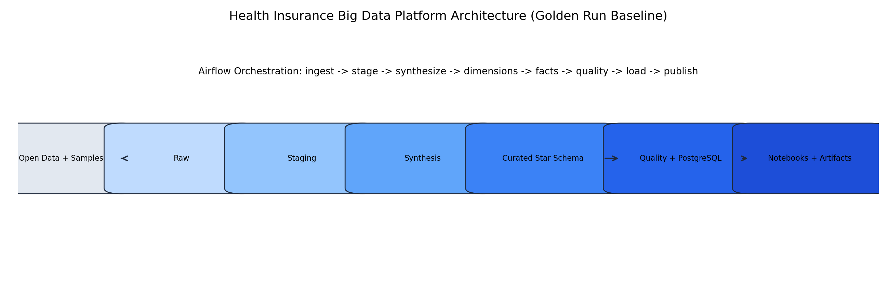
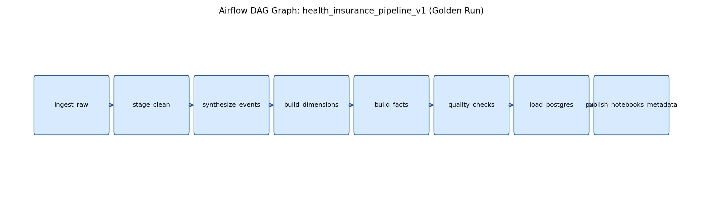
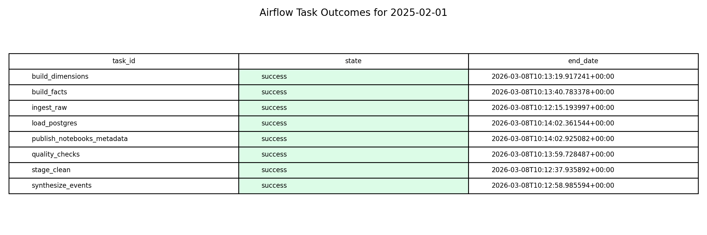
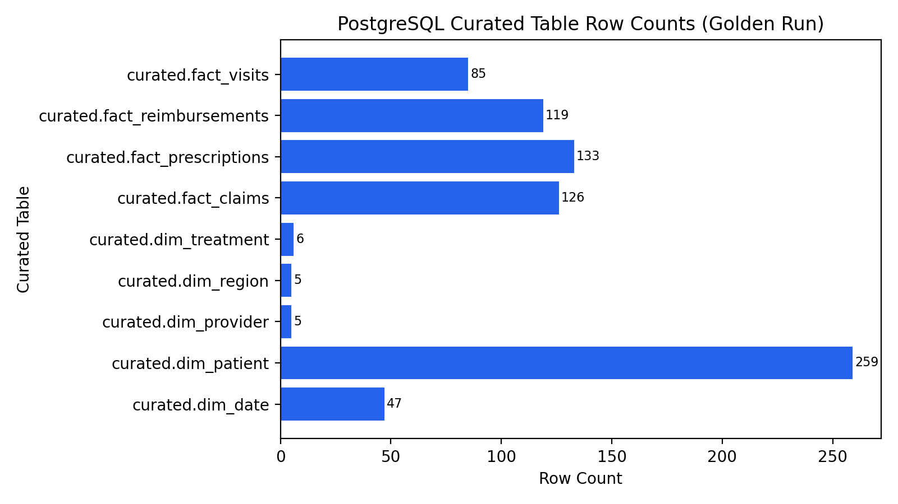
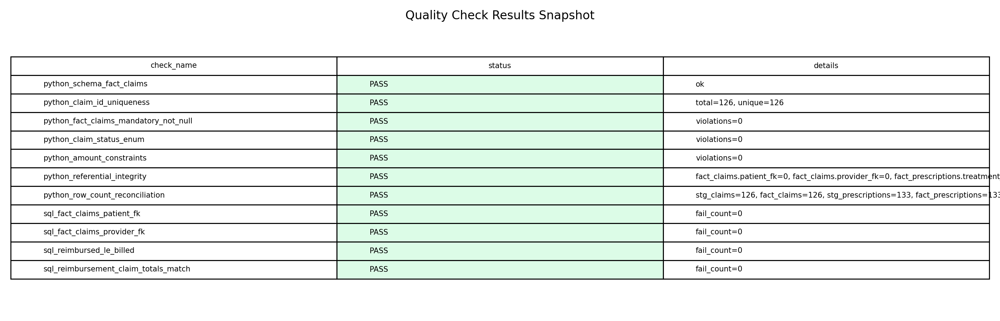
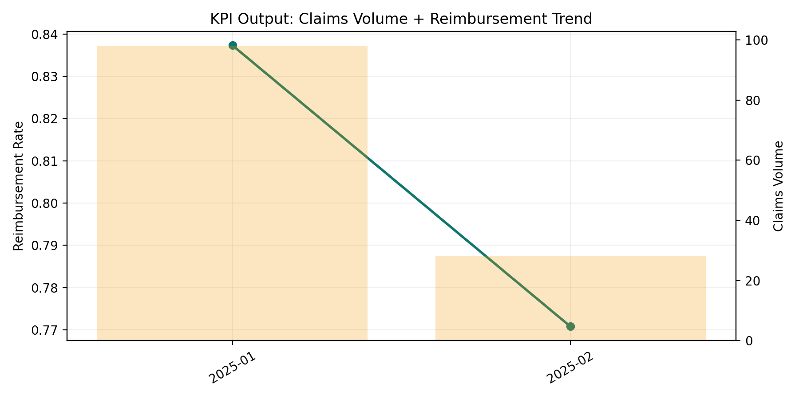
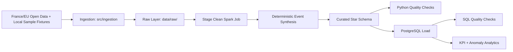

# Health Insurance Big Data Platform

End-to-end, Docker-first data platform for health insurance analytics using France/EU open data, deterministic pseudonymized synthesis, Spark transformations, Airflow orchestration, and PostgreSQL serving.

## Why This Project Is Recruiter-Ready

| Signal | Evidence |
|---|---|
| Full orchestrated pipeline | [Airflow DAG success (8/8 tasks)](artifacts/golden-run/2025-02-01/task_run_summary.md) |
| Data engineering depth | Ingestion, staging, synthesis, star-schema modeling, quality framework, SQL analytics |
| Reproducibility | Sample-first fallback with explicit source health reporting |
| Production mindset | Dockerized services, idempotent run partitions, persisted quality checks |
| Measurable outputs | Curated table counts, KPI trend snapshots, anomaly-prep feature snapshots |

## Visual Walkthrough
'''mermaid
flowchart TD
    %% -------- Sources --------
    A1[France / EU Open Data Sources]
    A2[Local Sample Fixtures<br/>data/raw/sample]

    %% -------- Ingestion --------
    B[Ingestion Module<br/>src.ingestion.run]
    C[Raw Layer<br/>data/raw + manifest.json + source_health_report.md]

    %% -------- Processing --------
    D[Stage Clean<br/>Spark]
    E[Synthetic Event Expansion<br/>deterministic pseudonymized events]
    F[Curated Star Schema<br/>Spark curated tables]

    %% -------- Quality / Serving --------
    G[Python Quality Checks]
    H[PostgreSQL Load]
    I[SQL / FK Quality Checks]
    J[Notebook Analytics<br/>KPI + anomaly outputs]
    K[Evidence Artifacts<br/>golden-run outputs + screenshots]

    %% -------- Orchestration --------
    O[Airflow DAG<br/>health_insurance_pipeline_v1]
    P[Docker Compose Runtime]

    %% -------- Flow --------
    A1 -->|CSV / API| B
    A2 -->|Fallback mode| B
    B --> C
    C --> D
    D --> E
    E --> F
    F --> G
    F --> H
    H --> I
    H --> J
    G --> K
    I --> K
    J --> K

    %% -------- Orchestration links --------
    P --> O
    P --> H
    O -. orchestrates .-> B
    O -. orchestrates .-> D
    O -. orchestrates .-> E
    O -. orchestrates .-> F
    O -. orchestrates .-> G
    O -. orchestrates .-> H
    O -. orchestrates .-> I
    O -. orchestrates .-> J
'''
### 1) Architecture



### 2) Orchestration + Runtime Evidence




### 3) Data + Quality Evidence




### 4) Analytics Output



## How The Code Works

### Pipeline Data Flow



### Airflow Task to Module Mapping

| Airflow task | Main module | What it does | Output |
|---|---|---|---|
| `ingest_raw` | `src.ingestion.run` | Pull source CSVs; fallback to fixtures when live endpoints fail | `data/raw/<run_date>/*.csv`, `manifest.json`, `source_health_report.md` |
| `stage_clean` | `src.transformations.stage_clean` | Normalize schema/types/enums and clean source data | `data/staging/<run_date>/stg_*` |
| `synthesize_events` | `src.transformations.synthesize_events` | Generate deterministic pseudonymous patient-level events | staged event parquet tables |
| `build_dimensions` | `src.transformations.build_dimensions` | Build `dim_*` tables and surrogate keys | curated dimensions parquet |
| `build_facts` | `src.transformations.build_facts` | Build `fact_*` tables with joins and business metrics | curated facts parquet |
| `quality_checks` | `src.quality.run` | Run Python-native data quality validations | curated quality JSON + DB inserts |
| `load_postgres` | `src.transformations.load_postgres` | Load curated model to PostgreSQL and run SQL checks | `curated.*`, `quality.check_results` |
| `publish_notebooks_metadata` | `src.utils.publish_metadata` | Publish run metadata for analysis layer | `data/curated/<run_date>/metadata.json` |

### Curated Star Schema (Golden Run Snapshot)

| Table | Rows |
|---|---:|
| `curated.dim_date` | 47 |
| `curated.dim_patient` | 259 |
| `curated.dim_provider` | 5 |
| `curated.dim_region` | 5 |
| `curated.dim_treatment` | 6 |
| `curated.fact_claims` | 126 |
| `curated.fact_prescriptions` | 133 |
| `curated.fact_reimbursements` | 119 |
| `curated.fact_visits` | 85 |

## Golden Run Results (`2025-02-01`)

| Metric | Value |
|---|---|
| DAG state | `success` |
| Task success rate | `8/8` |
| Quality failures | `0` |
| Reimbursement rate range | `0.7708` to `0.8373` |

### KPI Trend Snapshot

| Year | Month | Claims Volume | Billed Total | Reimbursed Total | Reimbursement Rate |
|---:|---:|---:|---:|---:|---:|
| 2025 | 1 | 98 | 23350.0 | 19550.0 | 0.8373 |
| 2025 | 2 | 28 | 12000.0 | 9250.0 | 0.7708 |

## Reproducible-First Design

- Default config keeps `ingestion.use_sample_on_failure: true`.
- Every source is logged in manifest and source-health report for auditability.
- Optional live-source mode is isolated in `src/config/pipeline.live.yaml`.

## Run It Locally (Docker, 3 Commands)

```bash
cp .env.example .env
docker compose build airflow-init
docker compose up -d
```

Run the full DAG for the baseline date:

```bash
docker compose exec -T airflow-webserver airflow dags test health_insurance_pipeline_v1 2025-02-01
```

## Tech Stack

| Layer | Tools |
|---|---|
| Orchestration | Airflow 2.9.x |
| Processing | PySpark 3.5.x |
| Storage/Serving | PostgreSQL 15 |
| Analytics | Jupyter + SQL notebooks |
| Runtime | Docker Compose |
| Quality | Native Python checks + SQL integrity checks |

## Evidence Pack

- [Golden run report](artifacts/golden-run/2025-02-01/run_report.md)
- [Task-level proof](artifacts/golden-run/2025-02-01/task_run_summary.md)
- [Quality results snapshot](artifacts/golden-run/2025-02-01/quality_check_results.csv)
- [KPI SQL output snapshot](artifacts/golden-run/2025-02-01/sql_kpi_claims_trend.csv)
- [Anomaly feature snapshot](artifacts/golden-run/2025-02-01/sql_anomaly_provider_features.csv)
- [Claim-to-evidence mapping](docs/showcase-evidence.md)

## Compliance Notes

- No PHI is used.
- Patient records are deterministic pseudonymized synthetic derivations from open aggregates.
- Pipeline is idempotent by `run_date` partition.
